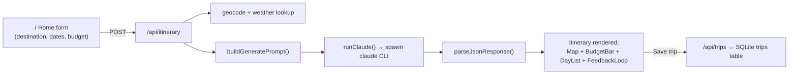
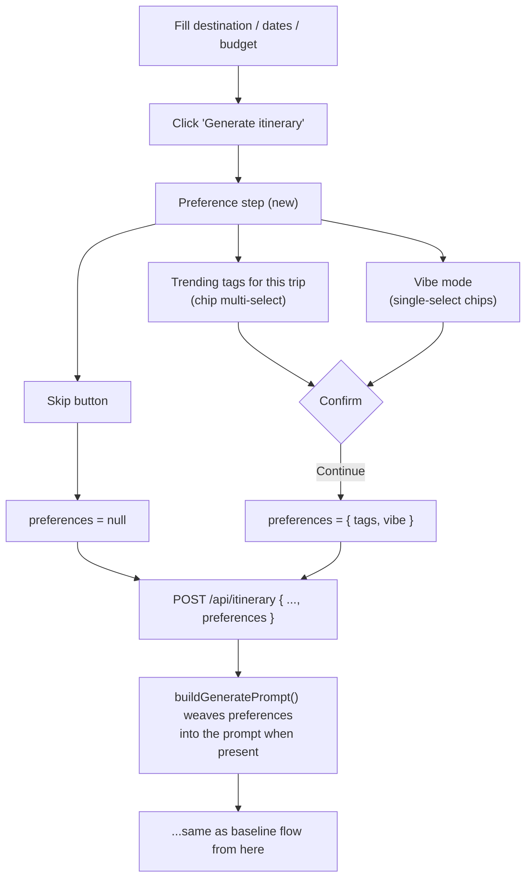
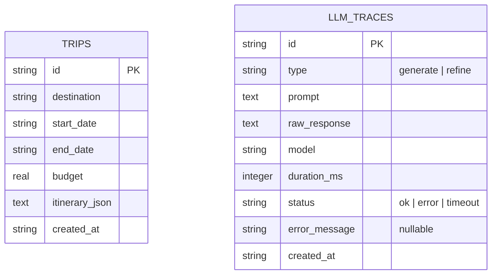
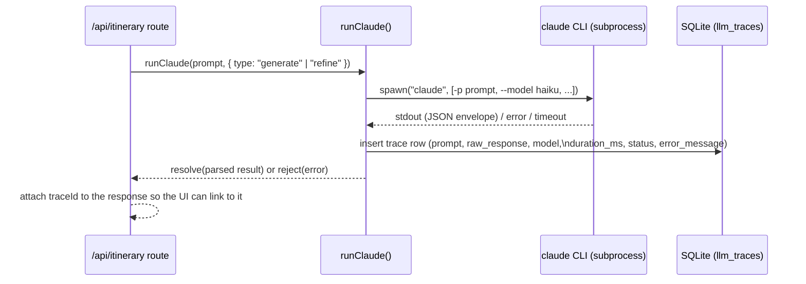
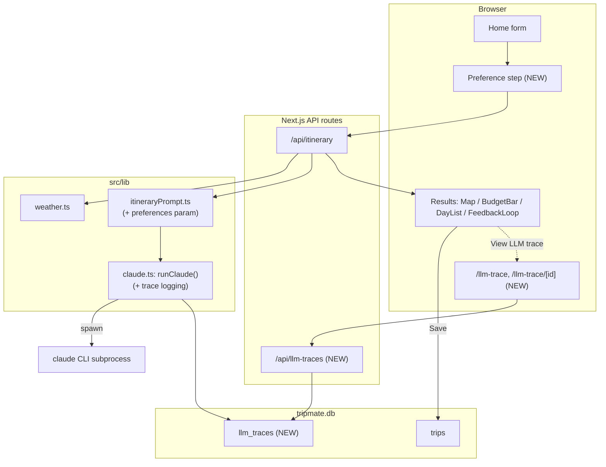

# TripMate — System Design: Preference/Vibe Step + LLM Trace Viewer

This document specs two additions to the existing itinerary-generation flow:

1. **A preference step** between "fill out the trip form" and "generate itinerary" — the
   user picks trending interests and/or a vibe (or skips it), and that gets folded into
   the prompt sent to Claude.
2. **An LLM trace viewer** — a separate URL where every prompt sent to Claude and the raw
   response it returned can be inspected, linked from the main app.

Everything downstream of generation (map, budget bar, day list, feedback/refine loop,
save-to-trip) is unchanged.

---

## 1. Current flow (baseline)



`runClaude` (`src/lib/claude.ts`) spawns the `claude` CLI as a one-shot Haiku call and
throws away everything except the final parsed string — the actual prompt and raw model
output are never persisted anywhere today.

---

## 2. New flow: preference / vibe step

### 2.1 UX



- **Trending tags**: a curated, general set shown as chips — not destination-scraped
  (no extra API/LLM call needed for v1). Examples: `Food & nightlife`, `Museums &
  history`, `Outdoors & hiking`, `Shopping`, `Hidden gems`, `Family-friendly`,
  `Photogenic spots`, `Budget eats`. Multi-select.
- **Vibe mode**: single-select chip group — `Party`, `Nature`, `Relax`, `Culture`,
  `Adventure`, `Foodie`, `Romantic`, `Family`. Just a tag that gets woven into the prompt
  as a tone/style hint, not a separate system.
- **Skip**: proceeds exactly like today — `preferences` stays `null`, prompt is
  unchanged from the current baseline text.
- This is a step *inside* the existing form flow (e.g. a second card that swaps in after
  clicking Generate, or an expand-in-place section), not a route change — no new URL.

> v2 idea (not in this spec): make trending tags destination-aware by asking Claude for
> 5-6 "trending in {destination} right now" tags before showing the chip picker. Left as
> a follow-up since it adds a second LLM round-trip before the user even starts.

### 2.2 Data shape

```ts
// src/lib/types.ts (extend)
export interface ItineraryPreferences {
  tags: string[];       // subset of the curated trending list, e.g. ["Outdoors & hiking", "Budget eats"]
  vibe: string | null;  // one of the vibe chips, or null
}
```

`POST /api/itinerary` body gains an optional `preferences?: ItineraryPreferences | null`
field, passed straight through from the client.

### 2.3 Prompt integration

`buildGeneratePrompt` (`src/lib/itineraryPrompt.ts`) takes an extra optional
`preferences` param and, when present, inserts one extra paragraph before the "Respond
with ONLY valid JSON" instruction, e.g.:

```
Traveler preferences: leans toward a "Nature" vibe; especially interested in Outdoors & hiking, Hidden gems.
Weight stop selection toward these interests without ignoring the weather/budget constraints above.
```

When `preferences` is `null`/omitted (skip case), the prompt is byte-for-byte identical
to today — no behavior change for users who skip.

---

## 3. New flow: LLM trace viewer

### 3.1 Purpose

A way to see, for any itinerary generation or refine call: the exact prompt sent to
Claude, the raw (pre-parse) response, timing, and pass/fail status — for debugging
prompt quality and understanding what the model actually did.

### 3.2 Data model

New table alongside the existing `trips` table in the same SQLite file
(`src/lib/db.ts`):



`llm_traces` is standalone (no FK to `trips`) since a trace can exist for a generation
the user never saves.

### 3.3 Where trace rows get written

`runClaude()` in `src/lib/claude.ts` is the single choke point for every Claude CLI
call, so it's the natural place to log:



Logging happens on *every* outcome (success, non-zero exit, timeout, non-JSON
response) — the failure cases are often the most useful ones to inspect.

### 3.4 New routes/pages

- `GET /api/llm-traces` — paginated list (id, type, status, created_at, short prompt
  preview).
- `GET /api/llm-traces/[id]` — full row (full prompt + full raw response).
- `/llm-trace` — table view of recent calls, newest first, status badge
  (ok/error/timeout), click through to detail.
- `/llm-trace/[id]` — two-pane detail: prompt on the left (verbatim, monospace), raw
  response on the right (pretty-printed JSON via the same fence-stripping helper already
  in `parseJsonResponse`, falling back to raw text if it doesn't parse).

### 3.5 Linking it from the main app

- `PageHeader` (`src/components/PageHeader.tsx`) gets a small persistent third link —
  e.g. `LLM trace` — next to the existing nav link, present on every page.
- The itinerary result view (`src/app/page.tsx`, after a successful generate/refine)
  shows a subtle `View LLM trace for this call →` link using the `traceId` returned
  alongside `itinerary`, deep-linking straight to `/llm-trace/[id]`.

---

## 4. Combined end-to-end diagram



---

## 5. File-level implementation map

| File | Change |
|---|---|
| `src/lib/types.ts` | add `ItineraryPreferences` type |
| `src/lib/itineraryPrompt.ts` | `buildGeneratePrompt` accepts optional `preferences`, weaves it into the prompt text |
| `src/lib/claude.ts` | `runClaude` accepts `{ type }`, writes a trace row on every outcome (success/error/timeout), returns `{ result, traceId }` |
| `src/lib/db.ts` | add `llm_traces` table + `insertTrace` / `listTraces` / `getTrace` helpers |
| `src/app/api/itinerary/route.ts` | accept `preferences` in body, pass through, return `traceId` alongside `itinerary` |
| `src/app/api/llm-traces/route.ts` (new) | `GET` list |
| `src/app/api/llm-traces/[id]/route.ts` (new) | `GET` detail |
| `src/components/PreferenceStep.tsx` (new) | trending-tag chips, vibe chips, skip button |
| `src/components/PageHeader.tsx` | add "LLM trace" nav link |
| `src/app/page.tsx` | insert preference step between form submit and calling `/api/itinerary`; show trace link after results |
| `src/app/llm-trace/page.tsx` (new) | list view |
| `src/app/llm-trace/[id]/page.tsx` (new) | detail view |

## 6. Open questions

- Should the trace viewer be gated behind anything (it's currently a public app with no
  auth), given prompts could include a destination/budget a user might not want public?
  For now, scope this as a local/dev-facing tool, same trust level as `/trips`.
- Should trending tags eventually be destination-aware (v2, see §2.1 note) instead of a
  fixed curated list?
